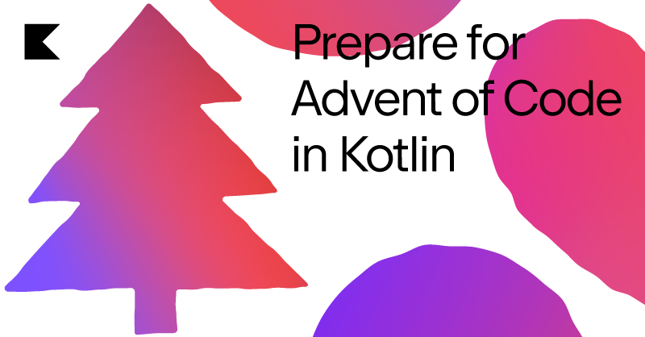

# Advent of code 2021

## Introduction
This is a project to participate in [AdventOfCode 2021](https://adventofcode.com/2021)

Advent of Code is an Advent calendar of small programming puzzles for a variety of skill sets and skill levels that can be solved in any programming language you like. People use them as a speed contest, interview prep, company training, university coursework, practice problems, or to challenge each other.

This year I'm participating using Kotlin:

Project by Hans Zuidervaart, december 2021

## Sources
- [Get Ready for Advent of Code 2021](https://www.youtube.com/watch?v=6-XSehwRgSY)
- [Advent of Code 2021 in Kotlin](https://blog.jetbrains.com/kotlin/2021/11/advent-of-code-2021-in-kotlin/)
- [Kotlin](https://kotlinlang.org/)
- [Ascii art Advent of code 2021!](http://patorjk.com/software/taag/#p=display&f=Cursive&t=Advent%20of%20code%202021!)
